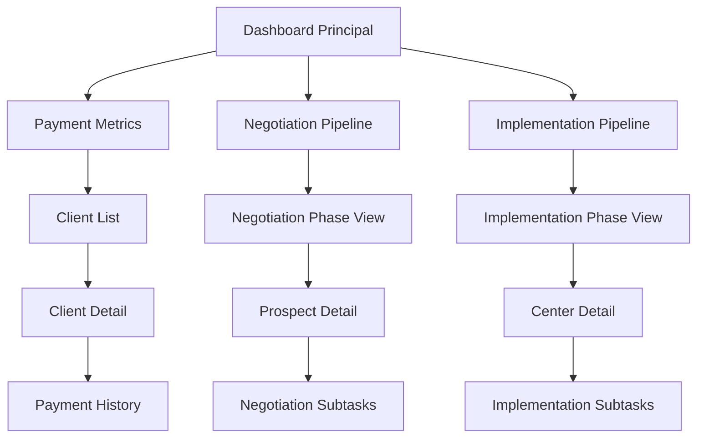

# Documento de Diseño - Sistema Integral de Gestión CEO

## Overview

El sistema integral de gestión CEO es una aplicación Vue.js + Ionic que combina tres módulos principales: seguimiento de pagos de clientes, pipeline de negociación y pipeline de implementación. La arquitectura está diseñada para ser modular, escalable y preparada para migración futura de LocalStorage a Firebase. El sistema utiliza un enfoque de componentes reutilizables y servicios centralizados para mantener la consistencia de datos entre módulos.

## Architecture

### Arquitectura General

```
┌─────────────────────────────────────────────────────────────┐
│                    CEO App (Ionic + Vue.js)                │
├─────────────────────────────────────────────────────────────┤
│  Dashboard Principal                                        │
│  ├── Payment Metrics                                       │
│  ├── Negotiation Pipeline                                  │
│  └── Implementation Pipeline                               │
├─────────────────────────────────────────────────────────────┤
│  Módulos Principales                                        │
│  ├── Payment Tracking Module                               │
│  ├── Negotiation Pipeline Module                           │
│  └── Implementation Pipeline Module                        │
├─────────────────────────────────────────────────────────────┤
│  Servicios Compartidos                                      │
│  ├── StorageService (LocalStorage)                         │
│  ├── ClientService                                         │
│  ├── PipelineService                                       │
│  └── SubtaskService                                        │
├─────────────────────────────────────────────────────────────┤
│  Componentes Reutilizables                                  │
│  ├── PipelineCard                                          │
│  ├── SubtaskList                                           │
│  ├── StatusBadge                                           │
│  └── ClientCard                                            │
└─────────────────────────────────────────────────────────────┘
```

### Flujo de Navegación



## Components and Interfaces

### Componentes Principales

#### 1. Dashboard Components

- **DashboardMain.vue**: Componente principal del dashboard
- **PaymentMetrics.vue**: Métricas de pagos (KPIs)
- **PipelineOverview.vue**: Vista general de ambos pipelines
- **QuickActions.vue**: Acciones rápidas del CEO

#### 2. Payment Tracking Components

- **ClientList.vue**: Lista de clientes con filtros
- **ClientCard.vue**: Tarjeta individual de cliente
- **ClientDetail.vue**: Detalle completo del cliente
- **ClientForm.vue**: Formulario para crear/editar clientes
- **PaymentHistory.vue**: Historial de pagos del cliente
- **BillingForm.vue**: Formulario de facturación mensual

#### 3. Pipeline Components (Reutilizables)

- **PipelineView.vue**: Vista general de un pipeline específico
- **PhaseColumn.vue**: Columna de una fase del pipeline
- **CenterCard.vue**: Tarjeta de centro/prospecto
- **CenterDetail.vue**: Detalle completo del centro
- **SubtaskList.vue**: Lista de subetapas tipo to-do
- **SubtaskItem.vue**: Item individual de subetapa
- **SubtaskForm.vue**: Formulario para crear/editar subetapas

#### 4. Shared Components

- **StatusBadge.vue**: Badge de estado con colores
- **DatePicker.vue**: Selector de fechas
- **ResponsiblePicker.vue**: Selector de responsables
- **ConfirmDialog.vue**: Diálogo de confirmación
- **LoadingSpinner.vue**: Indicador de carga

### Interfaces de Datos

#### Cliente/Centro Base

```typescript
interface BaseEntity {
  id: string;
  nombre: string;
  email: string;
  telefono: string;
  direccion: string;
  fechaCreacion: Date;
  notas: string;
  estado: "activo" | "inactivo";
}
```

#### Cliente con Información de Pagos

```typescript
interface Cliente extends BaseEntity {
  facturacionMensual: FacturacionMensual[];
  totalFacturado: number;
  totalPagado: number;
  cuotasVencidas: number;
  fechaUltimoPago: Date | null;
  fechaCompromiso: Date | null;
}
```

#### Centro en Pipeline

```typescript
interface Centro extends BaseEntity {
  pipelineType: "negotiation" | "implementation";
  currentPhase: string;
  subtasks: Subtask[];
  fechaInicioFase: Date;
  historialFases: PhaseHistory[];
}
```

#### Subetapa/Tarea

```typescript
interface Subtask {
  id: string;
  centroId: string;
  nombre: string;
  fechaInicio: Date;
  responsable: string;
  estado: "pendiente" | "en_progreso" | "completada" | "bloqueada";
  comentario: string;
  fechaCreacion: Date;
  fechaCompletada?: Date;
}
```

## Data Models

### Estructura de LocalStorage

```javascript
// Claves principales de almacenamiento
const STORAGE_KEYS = {
  CLIENTS: "ceo-app-clients",
  NEGOTIATION_CENTERS: "ceo-app-negotiation-centers",
  IMPLEMENTATION_CENTERS: "ceo-app-implementation-centers",
  SUBTASKS: "ceo-app-subtasks",
  SETTINGS: "ceo-app-settings",
  PIPELINE_CONFIG: "ceo-app-pipeline-config",
};
```

### Configuración de Pipelines

```typescript
interface PipelineConfig {
  negotiation: {
    phases: string[]; // ['Prospecto', 'Presentación', 'Propuesta', 'Negociación', 'Cierre']
    defaultSubtasks: { [phase: string]: string[] };
  };
  implementation: {
    phases: string[]; // ['Entrenamientos', 'Implementación', 'Go-Live', 'Finalizada']
    defaultSubtasks: { [phase: string]: string[] };
  };
}
```

### Modelo de Facturación Mensual

```typescript
interface FacturacionMensual {
  id: string;
  clienteId: string;
  mes: string; // "2024-01"
  montoFacturado: number;
  montoPagado: number;
  fechaUltimoPago: Date | null;
  fechaVencimiento: Date;
  fechaCompromiso: Date | null;
  estado: "pendiente" | "pagado" | "vencido";
  notas: string;
}
```

## Error Handling

### Estrategia de Manejo de Errores

#### 1. Errores de LocalStorage

```typescript
class StorageError extends Error {
  constructor(message: string, public operation: string) {
    super(message);
    this.name = "StorageError";
  }
}

// Manejo de errores de almacenamiento
try {
  localStorage.setItem(key, value);
} catch (error) {
  if (error.name === "QuotaExceededError") {
    // Manejar espacio insuficiente
    showErrorDialog("Espacio de almacenamiento insuficiente");
  } else {
    // Otros errores de localStorage
    showErrorDialog("Error al guardar datos");
  }
}
```

#### 2. Validación de Datos

```typescript
class ValidationError extends Error {
  constructor(message: string, public field: string) {
    super(message);
    this.name = "ValidationError";
  }
}

// Validaciones comunes
const validateClient = (client: Cliente): ValidationError[] => {
  const errors: ValidationError[] = [];

  if (!client.nombre.trim()) {
    errors.push(new ValidationError("Nombre es requerido", "nombre"));
  }

  if (client.email && !isValidEmail(client.email)) {
    errors.push(new ValidationError("Email inválido", "email"));
  }

  return errors;
};
```

#### 3. Estados de Error en Componentes

```typescript
// Composable para manejo de errores
export const useErrorHandler = () => {
  const error = ref<string | null>(null);
  const isLoading = ref(false);

  const handleError = (err: Error) => {
    console.error(err);
    error.value = err.message;
    isLoading.value = false;
  };

  const clearError = () => {
    error.value = null;
  };

  return { error, isLoading, handleError, clearError };
};
```

## Testing Strategy

### Estrategia de Testing

#### 1. Unit Tests (Vitest)

```typescript
// Ejemplo: ClientService.test.ts
describe("ClientService", () => {
  beforeEach(() => {
    localStorage.clear();
  });

  it("should create a new client", async () => {
    const client = {
      nombre: "Test Client",
      email: "test@example.com",
      telefono: "123456789",
    };

    const result = await ClientService.createClient(client);
    expect(result.id).toBeDefined();
    expect(result.nombre).toBe("Test Client");
  });

  it("should calculate payment metrics correctly", () => {
    const clients = [
      { totalFacturado: 1000, totalPagado: 800 },
      { totalFacturado: 2000, totalPagado: 1500 },
    ];

    const metrics = ClientService.calculateMetrics(clients);
    expect(metrics.totalFacturado).toBe(3000);
    expect(metrics.totalPagado).toBe(2300);
    expect(metrics.porcentajeLogrado).toBe(76.67);
  });
});
```

#### 2. Component Tests (Vue Test Utils)

```typescript
// Ejemplo: ClientCard.test.ts
describe("ClientCard", () => {
  it("should display client information correctly", () => {
    const client = {
      nombre: "Test Client",
      totalFacturado: 1000,
      totalPagado: 800,
      cuotasVencidas: 2,
    };

    const wrapper = mount(ClientCard, {
      props: { client },
    });

    expect(wrapper.text()).toContain("Test Client");
    expect(wrapper.find(".overdue-badge").exists()).toBe(true);
  });
});
```

#### 3. Integration Tests

```typescript
// Ejemplo: Pipeline flow test
describe("Pipeline Integration", () => {
  it("should move center between phases", async () => {
    const center = await PipelineService.createCenter({
      nombre: "Test Center",
      pipelineType: "implementation",
      currentPhase: "Entrenamientos",
    });

    await PipelineService.moveToPhase(center.id, "Implementación");

    const updatedCenter = await PipelineService.getCenterById(center.id);
    expect(updatedCenter.currentPhase).toBe("Implementación");
  });
});
```

#### 4. E2E Tests (Cypress)

```typescript
// Ejemplo: Dashboard navigation
describe("Dashboard Navigation", () => {
  it("should navigate to implementation pipeline", () => {
    cy.visit("/dashboard");
    cy.get("[data-cy=implementation-pipeline]").click();
    cy.url().should("include", "/pipeline/implementation");
    cy.get("[data-cy=phase-column]").should("have.length", 4);
  });
});
```

### Test Coverage Goals

- **Unit Tests**: 90% coverage en servicios y utilidades
- **Component Tests**: 80% coverage en componentes principales
- **Integration Tests**: Flujos críticos de usuario
- **E2E Tests**: Casos de uso principales del CEO

### Mocking Strategy

```typescript
// Mock de LocalStorage para tests
const localStorageMock = {
  getItem: vi.fn(),
  setItem: vi.fn(),
  removeItem: vi.fn(),
  clear: vi.fn(),
};

Object.defineProperty(window, "localStorage", {
  value: localStorageMock,
});
```
